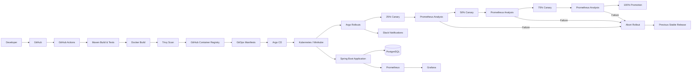

# Autonomous Release Orchestration Platform

A production-style DevOps project that automates application delivery from GitHub to Kubernetes using CI/CD, GitOps, progressive canary releases, automated Prometheus analysis, monitoring, database migrations, and Slack notifications.

The platform demonstrates how an application can be built, tested, containerized, deployed, progressively released, automatically validated, monitored, and protected from failed deployments.

---

## Architecture



---

## Tech Stack

### Backend
- Java 17
- Spring Boot
- Spring Data JPA
- Spring Boot Actuator
- Springdoc OpenAPI / Swagger
- Maven

### Database
- PostgreSQL 17
- Flyway

### CI/CD
- GitHub Actions
- Docker
- GitHub Container Registry
- Trivy vulnerability scanning

### Kubernetes & GitOps
- Kubernetes
- Minikube
- Argo CD
- Argo Rollouts

### Monitoring
- Prometheus
- Grafana
- Spring Boot Actuator metrics

### Notifications
- Argo Rollouts Notifications
- Slack Incoming Webhook

---

## Release Workflow

```text
Developer Push
      |
      v
GitHub Repository
      |
      v
GitHub Actions
      |
      +--> Maven Build
      +--> Automated Tests
      +--> Docker Image Build
      +--> Trivy Security Scan
      |
      v
GitHub Container Registry
      |
      v
GitOps Manifest
      |
      v
Argo CD
      |
      v
Argo Rollouts
      |
      +--> 25% Canary
      +--> Prometheus Analysis
      +--> 50% Canary
      +--> Prometheus Analysis
      +--> 75% Canary
      +--> Prometheus Analysis
      +--> 100% Promotion
```

A failed Prometheus analysis automatically stops the rollout and keeps the previously stable application version active.

---

## Canary Deployment

The rollout uses the following progressive deployment strategy:

```text
25%
 ↓
30 second pause
 ↓
Prometheus Analysis
 ↓
50%
 ↓
30 second pause
 ↓
Prometheus Analysis
 ↓
75%
 ↓
30 second pause
 ↓
Prometheus Analysis
 ↓
100%
```

Configuration is defined in:

```text
k8s/app-rollout.yaml
```

The rollout uses `maxSurge: 1` and `maxUnavailable: 0` so the stable application remains available while a new canary is evaluated.

---

## Automated Prometheus Analysis

Deployment validation is defined in:

```text
k8s/release-analysis-template.yaml
```

### Application Availability

Prometheus query:

```promql
sum(up{job="release-platform"})
```

The release passes when at least one healthy application target exists.

### HTTP 5xx Error Rate

The application also validates HTTP server error rates.

The deployment is accepted only when the HTTP 5xx error rate remains below:

```text
5%
```

If the configured failure limit is exceeded, Argo Rollouts aborts the canary.

---

## Automatic Failed-Release Protection

A controlled failed release was tested successfully.

Observed sequence:

```text
New Canary Revision
        |
        v
Canary Pod Healthy
        |
        v
Prometheus Analysis
        |
        X
   Analysis Failed
        |
        v
Rollout Aborted
        |
        v
Failed Canary Scaled Down
        |
        v
Previous Stable Release Retained
```

The test verified that:

- the new canary ReplicaSet was created;
- Prometheus analysis detected the intentionally failing condition;
- Argo Rollouts marked the deployment as failed;
- canary promotion stopped;
- traffic was returned to the stable release;
- the failed ReplicaSet was scaled down;
- the previous stable application remained available.

This demonstrates automatic protection against unhealthy releases.

---

## Slack Notifications

Argo Rollouts is integrated with Slack.

Automatic notifications include:

- 🚀 Rollout started or updated
- 🔄 Canary step completed
- ❌ Canary analysis failed
- ⛔ Rollout aborted
- ✅ Rollout completed

Example failed deployment flow:

```text
🚀 Argo Rollout started or updated

🔄 Canary step completed

❌ Canary analysis failed
Promotion stopped and stable release retained

⛔ Rollout aborted
Previous stable release remains active
```

Notification configuration:

```text
k8s/argo-rollouts-notifications.yaml
```

The Slack webhook is stored in a Kubernetes Secret and is not committed to Git.

---

## Monitoring

The Spring Boot application exposes Prometheus metrics through:

```text
/actuator/prometheus
```

Prometheus uses:

```text
job="release-platform"
```

Grafana visualizes the collected metrics.

Current dashboard panels include:

- Application availability
- HTTP request rate
- JVM heap usage
- HTTP 5xx error rate

### Application Availability

```promql
up{job="release-platform"}
```

---

## Grafana Credential Security

Grafana credentials are not hardcoded in Git.

The Helm values file references an existing Kubernetes Secret:

```yaml
admin:
  existingSecret: grafana-admin-secret
  userKey: admin-user
  passwordKey: admin-password
```

This prevents the Grafana admin password from being committed to the repository.

---

## PostgreSQL

PostgreSQL provides application persistence.

Kubernetes resources:

```text
k8s/postgres-deployment.yaml
k8s/postgres-service.yaml
k8s/postgres-pvc.yaml
```

A PersistentVolumeClaim is used so database data survives pod recreation.

---

## Flyway Database Migrations

Flyway manages database schema migrations.

Migration files are located under:

```text
src/main/resources/db/migration/
```

Database migrations are automatically validated and applied when the application starts.

---

## Docker

Build the application image:

```bash
docker build -t autonomous-release-platform .
```

Run it:

```bash
docker run -p 8080:8080 autonomous-release-platform
```

---

## Docker Compose

The application and PostgreSQL can also run locally with Docker Compose.

Start:

```bash
docker compose up --build
```

Stop:

```bash
docker compose down
```

---

## Kubernetes

Main manifests are under:

```text
k8s/
```

Important resources:

```text
app-deployment.yaml
app-rollout.yaml
app-service.yaml
release-analysis-template.yaml
argo-rollouts-notifications.yaml
configmap.yml
secret.yaml
postgres-deployment.yaml
postgres-service.yaml
postgres-pvc.yaml
```

---

## Argo CD

Argo CD configuration:

```text
argocd/release-platform-application.yaml
```

Argo CD continuously reconciles Kubernetes resources against the desired state stored in Git.

Expected healthy state:

```text
SYNC STATUS   HEALTH STATUS
Synced        Healthy
```

---

## Argo Rollouts Commands

Check rollout:

```bash
kubectl argo rollouts get rollout release-platform-rollout -n default
```

Watch rollout:

```bash
kubectl argo rollouts get rollout release-platform-rollout \
  -n default \
  --watch
```

Check AnalysisRuns:

```bash
kubectl get analysisrun -n default
```

---

## Application Health

Kubernetes pods:

```bash
kubectl get pods -n default
```

Spring Boot health:

```text
/actuator/health
```

Readiness:

```text
/actuator/health/readiness
```

Liveness:

```text
/actuator/health/liveness
```

---

## Swagger / OpenAPI

Swagger UI:

```text
/swagger-ui
```

OpenAPI specification:

```text
/api-docs
```

---

## CI Pipeline

GitHub Actions workflow:

```text
.github/workflows/ci.yml
```

The pipeline covers:

```text
Source Checkout
      |
      v
Java Setup
      |
      v
Maven Build
      |
      v
Tests
      |
      v
Docker Image
      |
      v
Trivy Scan
      |
      v
Container Registry
```

---

## Repository Structure

```text
.
├── .github/
│   └── workflows/
│       └── ci.yml
│
├── argocd/
│   └── release-platform-application.yaml
│
├── k8s/
│   ├── app-deployment.yaml
│   ├── app-rollout.yaml
│   ├── app-service.yaml
│   ├── argo-rollouts-notifications.yaml
│   ├── configmap.yml
│   ├── postgres-deployment.yaml
│   ├── postgres-pvc.yaml
│   ├── postgres-service.yaml
│   ├── release-analysis-template.yaml
│   └── secret.yaml
│
├── monitoring/
│   ├── grafana-deployment.yaml
│   ├── grafana-pvc.yaml
│   ├── grafana-service.yaml
│   ├── prometheus-deployment.yaml
│   ├── prometheus-service.yaml
│   └── prometheus.yml
│
├── src/
│   ├── main/
│   └── test/
│
├── docker-compose.yml
├── Dockerfile
├── grafana-values.yaml
├── prometheus-values.yaml
├── pom.xml
└── README.md
```

---

## Security Practices

The project includes:

- Slack webhook stored in Kubernetes Secret
- Grafana password stored in Kubernetes Secret
- No Slack webhook URLs committed to Git
- No hardcoded Grafana admin password
- Trivy container-image scanning
- Kubernetes Secrets separated from ConfigMaps
- GitOps-controlled deployments
- Prometheus deployment validation
- Automatic stable-release retention after failed canary analysis

---

## Verified Scenarios

### Successful Release

```text
Build
 ↓
Container Image
 ↓
Argo CD
 ↓
25% Canary
 ↓
Analysis Passed
 ↓
50% Canary
 ↓
Analysis Passed
 ↓
75% Canary
 ↓
Analysis Passed
 ↓
100% Promotion
 ↓
Healthy
```

### Failed Release

```text
New Revision
 ↓
Canary
 ↓
Prometheus Analysis
 ↓
Analysis Failed
 ↓
Rollout Aborted
 ↓
Failed Canary Scaled Down
 ↓
Stable Release Retained
```

Both release scenarios have been tested.

---

## Screenshots

Recommended portfolio screenshots can be stored under:

```text
docs/images/
```

Suggested screenshots:

1. GitHub Actions successful CI pipeline
2. Argo CD Synced / Healthy state
3. Successful canary rollout
4. Failed AnalysisRun
5. Stable release retained after failed rollout
6. Grafana dashboard
7. Slack rollout notifications
8. Swagger UI
9. Kubernetes running pods

Example:

```text
docs/
└── images/
    ├── github-actions.png
    ├── argocd-healthy.png
    ├── rollout-success.png
    ├── rollout-failure.png
    ├── grafana-dashboard.png
    ├── slack-notifications.png
    └── swagger-ui.png
```

---

## DevOps Concepts Demonstrated

- Continuous Integration
- Continuous Delivery
- GitOps
- Docker containerization
- Kubernetes orchestration
- Progressive delivery
- Canary deployments
- Automated deployment analysis
- Release failure protection
- Monitoring and observability
- Database persistence
- Database migrations
- Secret management
- Security scanning
- Slack release notifications

---

## Future Improvements

- Kubernetes Ingress
- HTTPS / TLS
- Horizontal Pod Autoscaler
- External Secrets Operator
- HashiCorp Vault
- Production Kubernetes cluster
- Dev / QA / Production environments
- Blue-green deployments
- OpenTelemetry tracing
- Alertmanager
- Automated performance testing
- Cloud deployment on AWS, Azure, or GCP

---

## Author

**Rohan Saxena**

DevOps / Backend Engineering Project